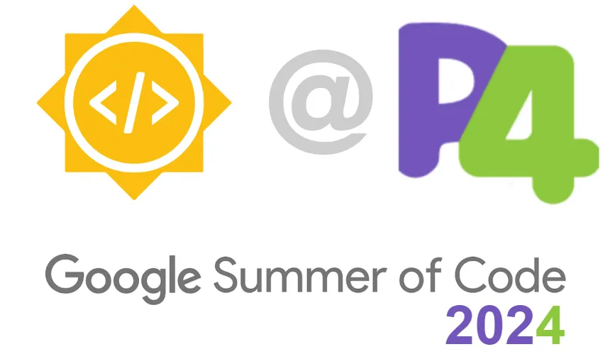

# GSoC 2024 Report : P4 Compiler Documentation
The official report of [my work in Google Summer of Code 2024](https://summerofcode.withgoogle.com/programs/2024/projects/u2HpJKI2)  
**Mentors:** [Davide Scano](https://github.com/Dscano), [Fabian Ruffy](https://github.com/fruffy)  
**Organization:** [The P4 Language Consortium](https://p4.org/)  
**Contributor:** [Adarsh Rawat](https://github.com/AdarshRawat1)  

## Project Overview:
For Google Summer of Code 2024, I developed an automated documentation system for the P4 Compiler. The project focused on improving the accessibility and organization of the P4 Compiler’s documentation, leveraging Doxygen for documentation generation and GitHub Actions for automation. The results include a centralized, up-to-date documentation site hosted on GitHub Pages, with enhanced navigation and interactive features.

## Technical Considerations:
> [!NOTE]  
> Previews in this report are mockups and do not reflect the current state of the documentation. They were used for iterative development during the project.
### Personal Repository & Netlify for Builds:
- Utilized a personal repository with Netlify for initial builds and sharing mockups. This approach allowed for iterative development and testing before deploying to GitHub Pages on official Repository.

- Mockups Created during iteration
  - [Doxygen output with obsolete documentation](https://p4-compiler-docs.netlify.app/)
  - [Sphinx version with “pydata” theme](https://p4-docs.netlify.app/)
  - [Doxygen + Doxygen Awesome CSS With Nav Bar](https://661bbb9fb70e8b584e959c0e--p4c-pototype3.netlify.app/)
  - [[Current] — Doxygen + Doxygen Awesome CSS Side bar only theme](https://p4lang.github.io/p4c/)

### Deployment Options:
- After considering various deployment platforms such as Netlify and Vercel, GitHub Pages was selected for deployment. This choice was motivated by the desire to avoid additional hosting costs and administrative overhead. This decision was reached after consulting with mentors.

### Workflow Considerations and Challenges:
- Setting Up External Pull Request Permissions: Configuring the necessary permissions for external pull requests presented a significant challenge due to stringent security requirements. The process required extensive troubleshooting and experimentation. Ultimately, the “pull_request_target” trigger proved instrumental in resolving this issue.
- Doxygen vs. Sphinx: Doxygen was chosen over Sphinx despite Sphinx offering potentially more flexibility. The decision was based on existing familiarity with Doxygen and the specific needs of the project, as well as the lack of a compelling reason to switch.

## Project Phases and Achievements

> Phase 1: Development

### Documentation Generation:
- configured Doxygen and Doxygen Awesome CSS for organized documentation.
- Utilized Doxygen’s diagram generation to visualize class and function relationships.
- Enhanced repository content organization for improved clarity.
  
### Documentation Sync and Cleanup:
- Updated documentation structure to match the latest codebase.
- Fixed broken links throughout the documentation.
### Centralized Hosting on GitHub Pages:
- Deployed documentation to GitHub Pages for real-time updates.
### Interactive Architecture Diagram:
- Added a dynamic homepage diagram illustrating the P4 Compiler architecture with links to relevant sections.
### Onboarding and Changelog Integration:
- Created comprehensive Contribution Guidelines to assist onboarding of new contributors, covering best practices, coding standards, and setup instructions.
- Added changelogs to the repository to keep track of changes, making it easier for contributors to follow updates and understand the project’s evolution.

> Phase 2: GitHub Actions Integration

### Automated Build Process:
- Developed a GitHub Action to automate documentation builds.
### PR Review Enhancement:
- Automated preview creation for pull requests, including preview link and deployment status in comments.
- Managed broken builds by updating PR comments with status information.
## Key Improvements

### High-Quality Diagrams with Interactive SVGs

- **Old Approach:** Diagrams were generated as PNGs in Doxygen. While functional, PNGs can become difficult to navigate, especially with complex graphs.
- **New Approach:** We’ve switched to interactive SVGs, which maintain high quality even when zoomed in or scaled. This change significantly enhances the usability of complex diagrams.

Click to View Previous Diagrams || Click to view Updated Diagrams

### Enhanced Visual Appeal
- **Dark Mode & Improved Formatting:** The updated documentation features a dark mode option and a better-formatted navigation bar, making the reading experience more comfortable and visually appealing.
### Well-Organized Structure with Enhanced Features
- **Permanent Links to Headings:** Added permanent links to specific sections of the documentation for easier sharing and navigation.
- **Customized Theme:** The theme is based on the P4 color scheme, offering a consistent visual experience.

> Closing Note:

## A Touch of Fun in the P4 Compiler Architecture Diagram
In the spirit of keeping things lively, we came up with the idea of sneaking a little Easter egg into the P4 Compiler’s documentation during one of our team meetings. If you’re feeling curious (or just bored), try clicking on the P4 Compiler logo in the top left corner of the homepage. What happens next? Well, the architecture diagram decides to throw a tiny celebration by animating its lines, as if to say, “Surprise! You found us!”

This quirky touch isn’t just for giggles — it’s a subtle reminder that even in the serious world of compiler documentation, a bit of fun can go a long way. Plus, it might just keep you on your toes, wondering what other surprises might be hiding in the corners of the site. Spoiler: there aren’t any… yet.

## Reflections and Learnings
During this project, I often had to change my approach and come up with new ideas to solve problems. I learned how a bit of help from others can quickly solve issues that might take me hours to figure out on my own.

I learned the importance of learning in public. Initially, I felt skeptical about sharing my progress and failures openly, but the overwhelmingly positive response and genuine support from the community and mentors reassured me. This encouragement was instrumental in helping me work confidently towards the project.

This was one of the best experiences I’ve ever had. I sincerely thank Google and my project mentors for selecting me for the GSoC program and giving me the opportunity to discover how amazing coding can be.

